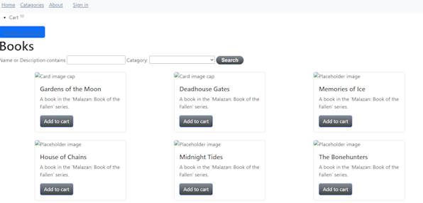
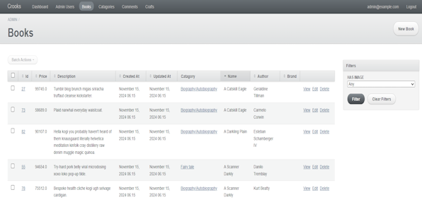

In a full stack development course in college, I had made a fully functional eCommerce website using Ruby on Rails.
While you may say, "Tal, this website is really ugly!", I'd say your wrong and cry later so please don't say that. 

Without further ado, here's the title page for all you nice people :

While the first few books there are of the Malazan series, there are over a 1000 book titles randomly generated through the faker ruby gem.
A lot of the work here was primarily done through gem integrations, something that I greatly appreciate about ruby. It's very easy to
find a gem for whatever idea you may have. The gem does the brunt of the work, while you mainly have to figure out how to integrate your work into them. They tend to offer enough flexability that really you can just use many as templates for whatever it is you want.   

Something I want to point out that isn't true anymore, is the images that were added to some of the books. I used google cloud storage to store them on a now unfunded account. At the time, the admin gem I had used had integration with google cloud, leaving all the storage of images to the cloud.

This admin page was also done with the use of a beautiful beautiful ruby gem. To set it up, all I needed was to add in my database info. 
From there, I am able to add, edit, view, and delete or add CRUD features as you tech savvy people would call it. There is a admin login page implamented within this gem as well to ensure some level of security there. The image option in the admin pages directly linked to google cloud, which took me a very long time to figure out as my first array into integrating cloud storage with code.

