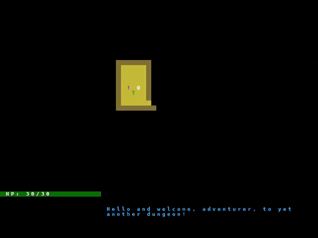

This project was how I taught myself Python! I ended up following a [tutorial](https://rogueliketutorials.com/) and writing my own notes as I went through it. An important part of the learning process for me was making sure I understood all code on the screen. Anytime an explanation wasn't offered, or I couldn't infer what a block of code meant, I would do some of my own research and comment it in for future reference. I also kept a document filled with notes that I still use when coding in Python! Was a great great help in my IoT class which used MicroPython :).

Here's a sample of the gameplay:

It was a very long process but I'm proud of getting through this! As you can see in the above gif, there's movement, items, enemies, combat and a log!! The log is especially useful, it even shows if there are any exception through a cute little error messasge.

